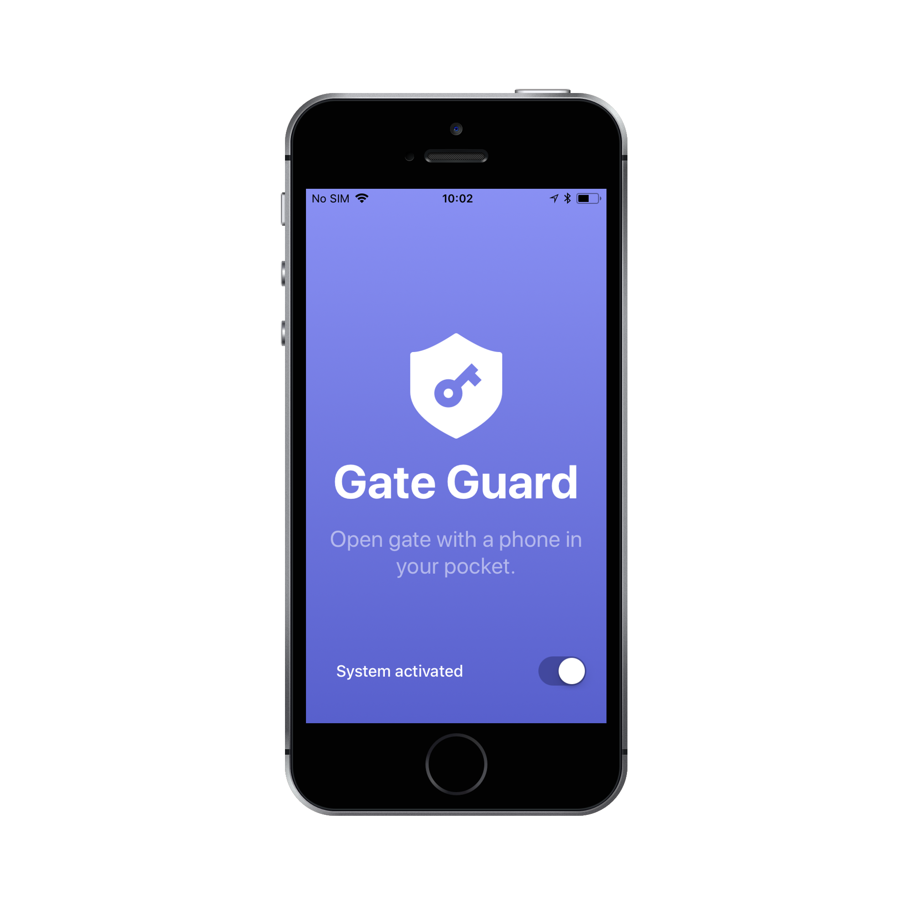

# **Gate Guard app for *iPhone***

## General information

The application is part of the access control system for the main gate of the building. Read about it in the article: [How to implement door unlocking system with Raspberry Pi, iPhone and service in cloud.](https://blog.infullmobile.com/how-to-implement-door-unlocking-system-with-raspberry-pi-iphone-and-service-in-cloud-3f55b76d700a).

## Requirements

- iPhone with iOS 10.3 or newer
- Xcode 9.3
- Swift 4.1

## Usage

Please, refer to the article for more details.

## Screenshots

## License

Released under the MIT license. See the LICENSE file for more info.
